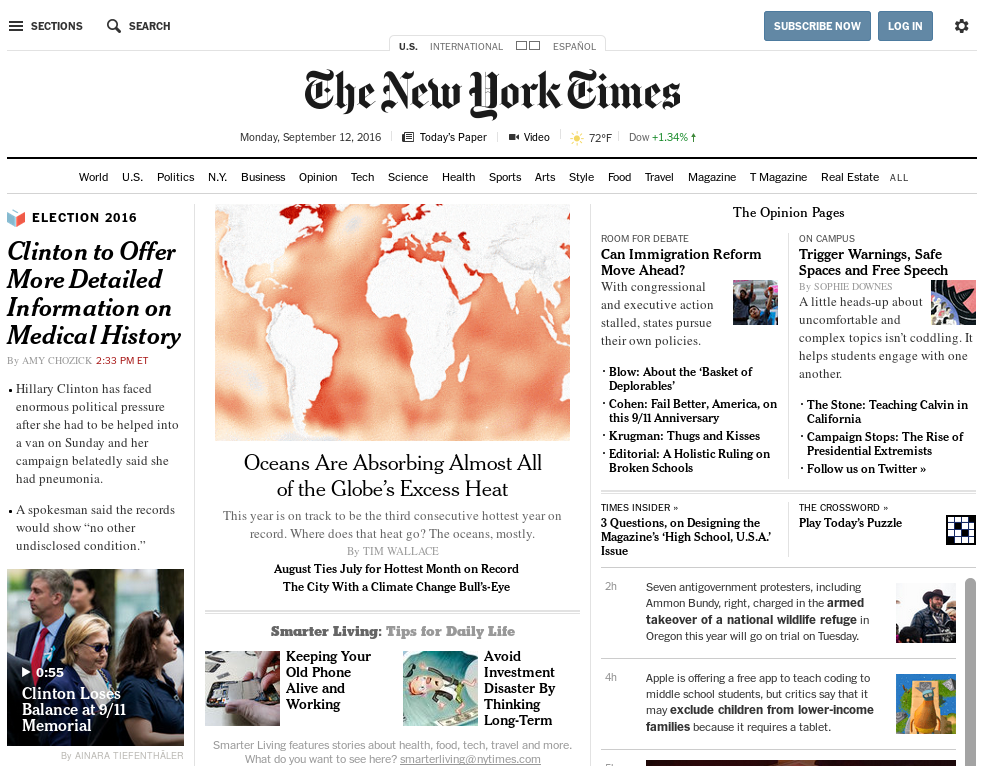
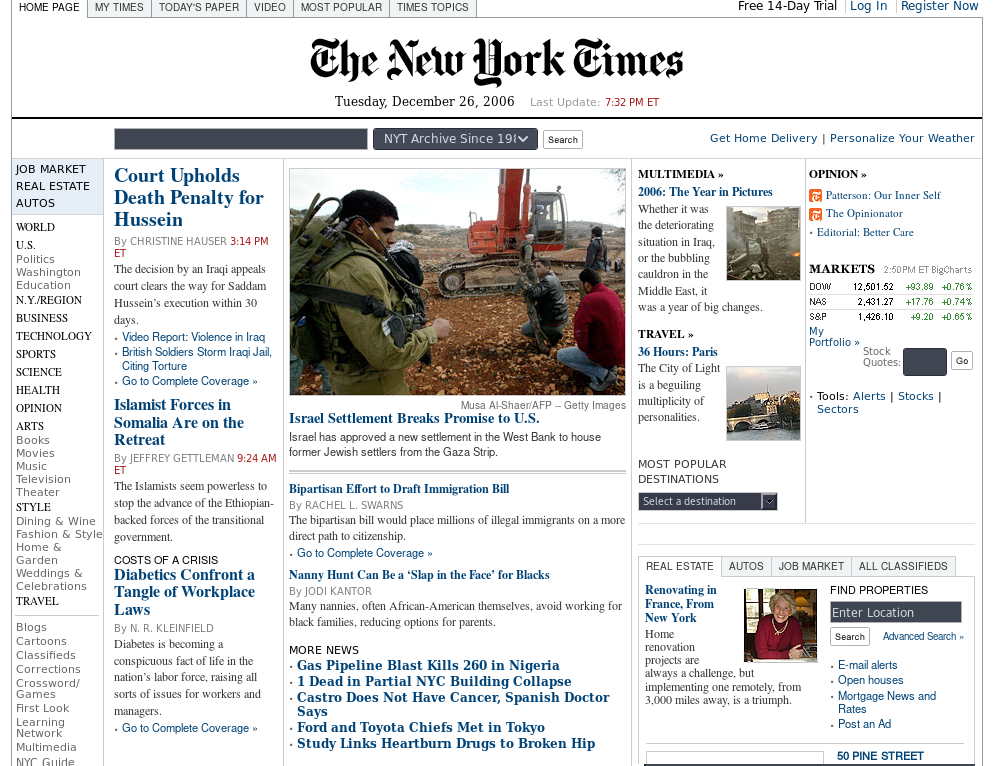

# Задание 0
**_Рассматривается интерфейс сайта NYTimes.com дизайна 2006 года (unsuccessful) и 2015 года (successful)._**

|Удачный интерфейс | Неудачный интерфейс|
|--------------|---------------|
|  |  |
| Страница максимально разгружена от лишнего текста, который, в свою очередь, сбалансирован изображениями. Лишние категории и подкатегории перенесены в 
выплывающий сплит слева (при нажатии на кнопку *Section*). Ссылки, в основном, средним шрифтом, не мелким. | Страница перегружена текстом, все категории и 
подкатегории находятся в одном месте в левой части экрана, что не очень удобно, куча мелкошрифтовых ссылок (те же подкатегории). |

*Никита Ляпушкин*
